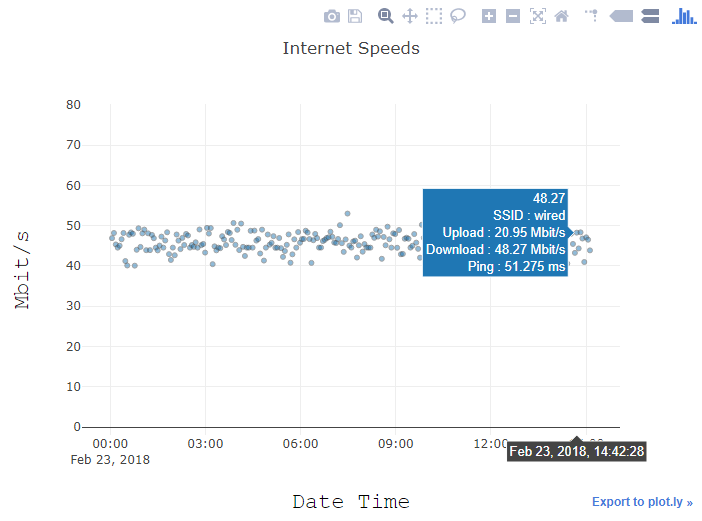
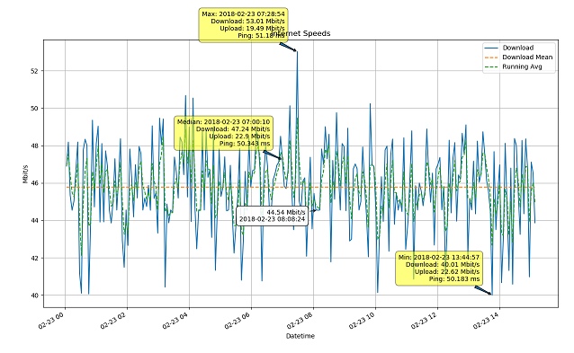

# Graph-Internet-Speed
Run and visualize speedtest data.

Set up the program to run in loop either using a cronjob or using the included runner script. When the program runs it saves the upload, download, ping, ssid and other information to a json file. These json can be generated into interactive plotly or matplotlib graphs by running the DrawSpeed.py module. 

## Usage

### runner.py
    runner -h.

eg) Run every 5 minutes for the next 24 hours saving results on desktop. (be sure this file exists)

    python runner.py -f 5 min -d 24 -resultfile %UserProfile%\Desktop\results.json

### SpeedTester.py
Main class which gets data on your internet speed.
#### SpeedTester
> Get the speed of Internet.

- \_\_del\_\_
- get\_previous\_results
- run\_test
- parse\_and\_save\_results
  - Parse results into the available keys.
- write\_results\_to\_file
  - Write the gathered results to a text file.

#### DrawSpeed.py

This is for for graphing the results of the SpeedTester

Currently you can create both plotly and matplotlib graphs, but the user interface is not very friendly. At this point if you want to modify the graphs you'll need to read/modify the main function. Otherwise just

    python DrawSpeed.py

Some sample graphs. (Data not very interesting)

